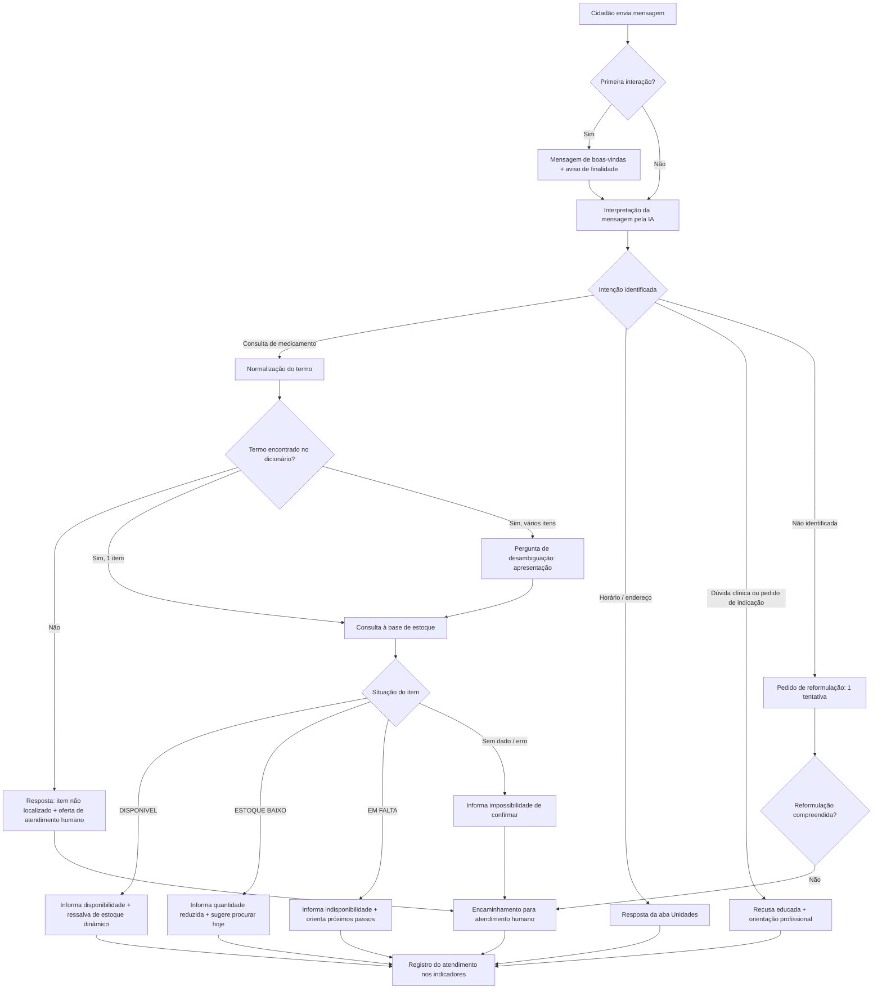

# Assistente Virtual Inteligente — Farmácia Municipal
## Fluxo de conversa e regras de resposta (protótipo com base fictícia)

> **Aviso:** este documento descreve uma demonstração construída sobre base de dados **fictícia**.
> Nenhuma informação de estoque aqui reproduzida corresponde à posição real de qualquer farmácia municipal.

---

## 1. Arquitetura da demonstração

```
Cidadão (WhatsApp / Telegram / simulador web)
        │
        ▼
Canal de mensagens  ──►  Camada de aplicação
                              │
                              ├─► Normalizador de termos  ──► aba "Sinonimos"
                              │
                              ├─► Consulta de estoque     ──► aba "Estoque"
                              │
                              └─► Modelo de linguagem (IA)
                                     ↑ recebe SOMENTE o resultado da consulta
                                     └ redige a resposta em linguagem natural
        │
        ▼
Resposta ao cidadão + registro de log (para indicadores do piloto)
```

**Princípio central:** a IA **não** decide se o medicamento existe. Ela apenas interpreta a
pergunta e redige a resposta a partir do registro devolvido pela consulta à base. Se a consulta
não retorna nada, a IA é instruída a declarar que não pôde confirmar — nunca a supor.

---

## 2. Fluxo principal



---

## 3. Regras de resposta da IA

**Obrigatórias**

1. Responder exclusivamente com base no registro devolvido pela consulta à base oficial.
2. Nunca afirmar disponibilidade sem um registro correspondente. Sem registro, dizer que não foi possível confirmar.
3. Sempre acompanhar a resposta positiva da ressalva de que o estoque é dinâmico e a consulta reflete o momento da interação.
4. Informar a data e a hora da última atualização do dado.
5. Não solicitar CPF, cartão SUS, nome completo, endereço, dados de receita ou qualquer informação de saúde do cidadão.
6. Encaminhar para atendimento humano sempre que houver dúvida, falha de consulta ou pedido explícito.

**Proibidas**

7. Diagnosticar, indicar, sugerir substituição ou comentar posologia, efeitos, interações ou uso de qualquer medicamento.
8. Reservar, separar ou prometer medicamento.
9. Estimar prazo de reposição sem informação oficial na base.
10. Responder sobre assuntos alheios à disponibilidade de medicamentos e ao funcionamento da farmácia.

---

## 4. Diálogos de demonstração

### 4.1 Consulta simples — item disponível

> **Cidadão:** tem dipirona ai?

> **Assistente:** Olá! Consultei o estoque da Farmácia Municipal Central.
> **Dipirona sódica 500 mg (comprimido): consta como disponível.**
> Posição registrada em 30/08/2026, às 07h00.
> O estoque muda ao longo do dia, então esta informação não garante a retirada. Posso ajudar com mais alguma consulta?

### 4.2 Nome comercial + item em falta

> **Cidadão:** vcs tem zitromax?

> **Assistente:** O medicamento que você citou corresponde à **Azitromicina 500 mg (comprimido)**.
> **Situação: consta como em falta** na posição registrada em 30/08/2026, às 07h00.
> Como o estoque é atualizado diariamente, vale consultar novamente nos próximos dias. Se preferir falar com um atendente da farmácia, digite **ATENDENTE**.

### 4.3 Erro de digitação

> **Cidadão:** preciso de metiformina 850

> **Assistente:** Entendi que se trata da **Metformina 850 mg (comprimido)**.
> **Situação: consta como disponível**, posição de 30/08/2026, às 07h00.
> Lembrando que a informação reflete o momento da consulta e o estoque pode mudar até a sua chegada.

### 4.4 Desambiguação de apresentação

> **Cidadão:** tem dipirona pra criança?

> **Assistente:** Temos duas apresentações cadastradas. Qual delas você procura?
> **1** – Dipirona 500 mg comprimido
> **2** – Dipirona 500 mg/mL solução oral (gotas)
> É só responder 1 ou 2.

> **Cidadão:** 2

> **Assistente:** **Dipirona sódica 500 mg/mL solução oral: consta como em falta** na posição de 30/08/2026, às 07h00.
> Não tenho previsão de reposição registrada. Para essa informação, digite **ATENDENTE**.

### 4.5 Estoque baixo

> **Cidadão:** paracetamol gotas

> **Assistente:** **Paracetamol 200 mg/mL solução oral: consta como disponível em quantidade reduzida** (posição de 30/08/2026, 07h00).
> Como restam poucas unidades, a retirada pode não ser possível se houver procura ao longo do dia.

### 4.6 Pergunta clínica — recusa

> **Cidadão:** posso tomar dipirona junto com o remédio de pressão?

> **Assistente:** Não posso orientar sobre uso, dosagem ou combinação de medicamentos — essa avaliação é do profissional de saúde.
> Procure o farmacêutico da unidade, a equipe da sua UBS ou o profissional que emitiu a receita.
> Posso ajudar apenas com a **disponibilidade** de medicamentos na Farmácia Municipal.

### 4.7 Item fora da relação municipal

> **Cidadão:** tem rivotril 0,25?

> **Assistente:** Localizei **Clonazepam 2 mg (comprimido)** na relação da farmácia, mas não encontrei a apresentação de 0,25 mg no cadastro.
> Não consigo confirmar essa apresentação por aqui. Digite **ATENDENTE** para falar com a equipe da farmácia.

### 4.8 Encaminhamento humano

> **Cidadão:** ATENDENTE

> **Assistente:** Certo. Vou encaminhar seu contato para a equipe da Farmácia Municipal Central.
> Atendimento de segunda a sexta, das 7h às 17h. Fora desse horário, o retorno ocorrerá no próximo dia útil.

---

## 5. Mensagens padrão

| Situação | Texto |
|---|---|
| Boas-vindas | Olá! Sou o assistente virtual da Farmácia Municipal. Informo se um medicamento **consta como disponível** no estoque. Não realizo reservas e não oriento sobre uso de medicamentos. |
| Aviso de finalidade | Este canal é apenas informativo e não substitui a avaliação de profissional de saúde. |
| Ressalva de estoque | O estoque muda ao longo do dia; esta consulta reflete a última posição registrada e não garante a disponibilidade na retirada. |
| Falha de consulta | Não consegui consultar o estoque neste momento. Tente novamente em alguns minutos ou digite **ATENDENTE**. |
| Termo não reconhecido | Não localizei esse medicamento no cadastro da farmácia. Você pode reescrever o nome ou digitar **ATENDENTE**. |
| Encerramento | Consulta encerrada. Sempre que precisar, é só enviar o nome do medicamento. |
| Aviso da demonstração | *(somente no protótipo)* ⚠️ Demonstração com dados fictícios. Os quantitativos não correspondem ao estoque real. |

---

## 6. Indicadores do piloto (registrados a cada atendimento)

| Indicador | Como é medido |
|---|---|
| Consultas realizadas | Total de sessões iniciadas |
| Taxa de resolução automática | Consultas concluídas sem encaminhamento humano ÷ total |
| Taxa de reconhecimento de termo | Mensagens em que o medicamento foi identificado ÷ total de consultas |
| Tempo médio de resposta | Do recebimento da mensagem ao envio da resposta |
| Encaminhamentos humanos | Total e motivo (termo não reconhecido, falha, pedido do cidadão) |
| Itens mais consultados | Ranking por código de medicamento |
| Consultas sobre itens em falta | Proxy do deslocamento evitado |
| Satisfação | Pergunta opcional de 1 a 5 ao fim da sessão |

Nenhum indicador exige identificação do cidadão. O identificador da sessão deve ser anonimizado
antes do armazenamento, em linha com a LGPD.

---

## 7. Roteiro de demonstração (5 minutos)

1. **Consulta bem-sucedida** — "tem dipirona?" → mostra a resposta positiva com a ressalva.
2. **Nome comercial** — "zitromax" → mostra o dicionário de sinônimos funcionando e o item em falta.
3. **Erro de digitação** — "metiformina" → mostra a tolerância a erros.
4. **Alteração ao vivo** — zerar o estoque de MED-001 na planilha e repetir a consulta 1 → mostra que a resposta vem da base, e não do modelo.
5. **Pergunta clínica** — mostra a recusa e o limite do escopo.
6. **Fechamento** — abrir a aba "Painel" e comentar quais indicadores o piloto real produziria.

O passo 4 é o mais importante para o gestor: é ele que demonstra que a informação tem origem na
fonte de dados, requisito central do Termo de Referência.

---

## 8. O que muda da demonstração para o piloto real

| Item | Demonstração | Piloto real |
|---|---|---|
| Fonte de dados | Planilha fictícia | Sistema oficial de controle de estoque, via API ou carga periódica |
| Canal | Simulador web ou Telegram | Número oficial homologado no WhatsApp Business API |
| Atualização | Manual | Automática, com carimbo de data e hora da origem |
| Dicionário de termos | 131 termos manuais | Ampliado com a Rename e os dados abertos da Anvisa, mais os termos coletados nos logs |
| Encaminhamento humano | Mensagem simulada | Fila real de atendimento da farmácia |
| Governança | Não aplicável | Perfis de acesso, registro de logs, política de retenção e adequação à LGPD |
